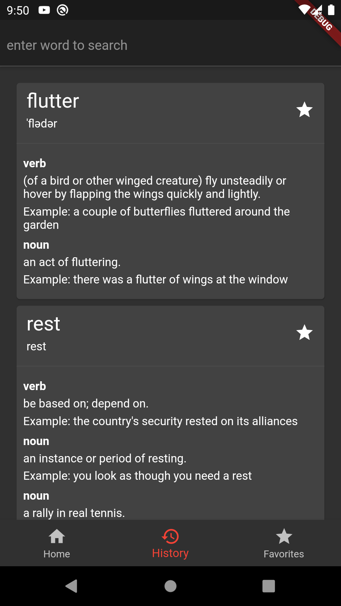
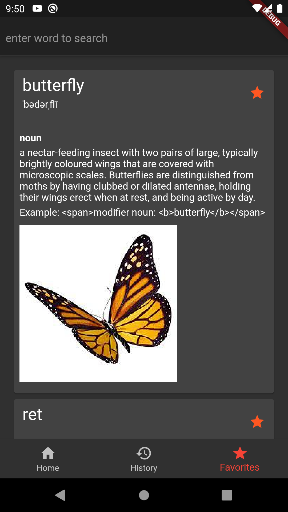

# Disctionary App

A dictionary app using [owlbot.info](https://owlbot.info) API and Flutter. 

- [Riverpod](https://riverpod.dev) as state management solution
- [hive](https://hivedb.dev) as offline storage solution
- [OwlbotDart](https://pub.dev/packages/owlbot_dart) package to interface with owlbot api

## Previews
   